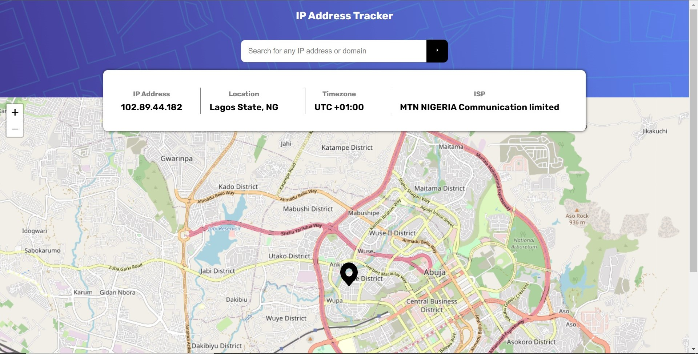

## IP Address Tracker

> IP address tracker gives information about any IP address that is provided to it..



## Built With 🌩️

- React
- LeafletJs

## Live Demo ☁️

[Live Demo Link](https://ip-address-tracker-khaki-nine.vercel.app/)

## Getting Started ☀️

To get a local copy up and running follow these simple example steps.

### Prerequisites

Install Node and npm using the `npm install` command on your command line, then install yarn using `npm install --global yarn`.

### Setup

Clone this repository by typing `git clone https://github.com/ikechukwu-peter/ip-address-tracker.git` on your terminal.

## Installation

```bash
$ yarn install
```

## Running the app

```bash
# development
$ yarn dev

# build
$ yarn build

# preview
$ yarn preview
```

### Usage

Navigate to the project directory `cd ip-address-tracker`, and run `yarn dev`. Or, visit the live demo at: https://ip-address-tracker-khaki-nine.vercel.app/

## Author

👤 **Ikechukwu Peter**

- GitHub: [@ikechukwu-peter](https://github.com/ikechukwu-peter)
- Twitter: [@pete_iyke](https://twitter.com/pete_iyke)
- LinkedIn: [LinkedIn](https://www.linkedin.com/in/peter-ikechukwu/)

## Show your support

Give a ⭐️ if you like this project!

## Acknowledgments

- Hat tip to geoipify and ipgeolocation for their awesome API.

## 📝 License

This project is [MIT] licensed.
